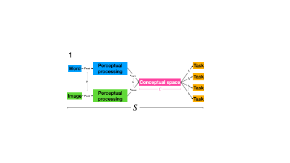
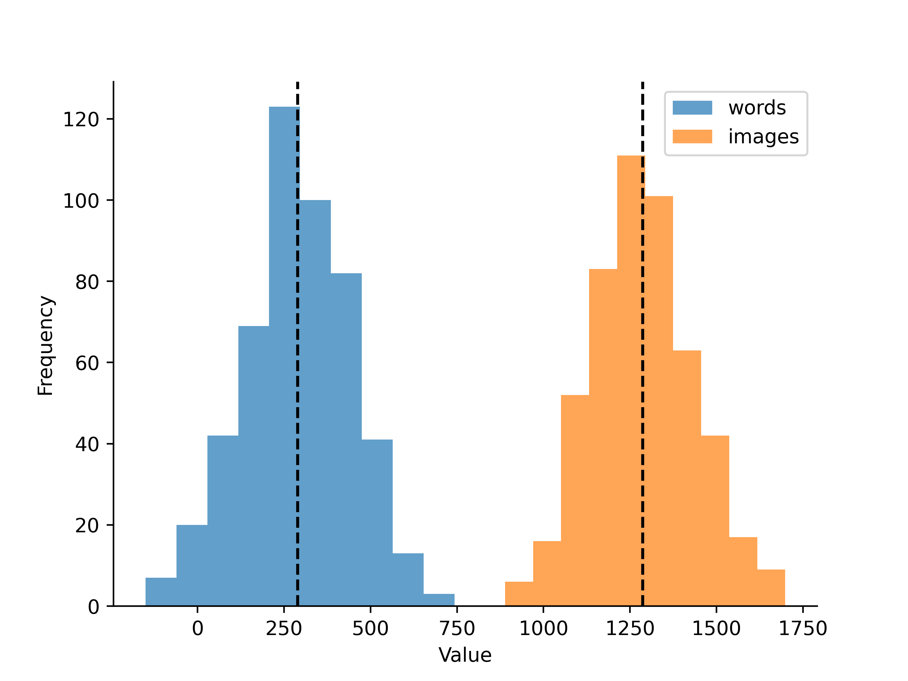
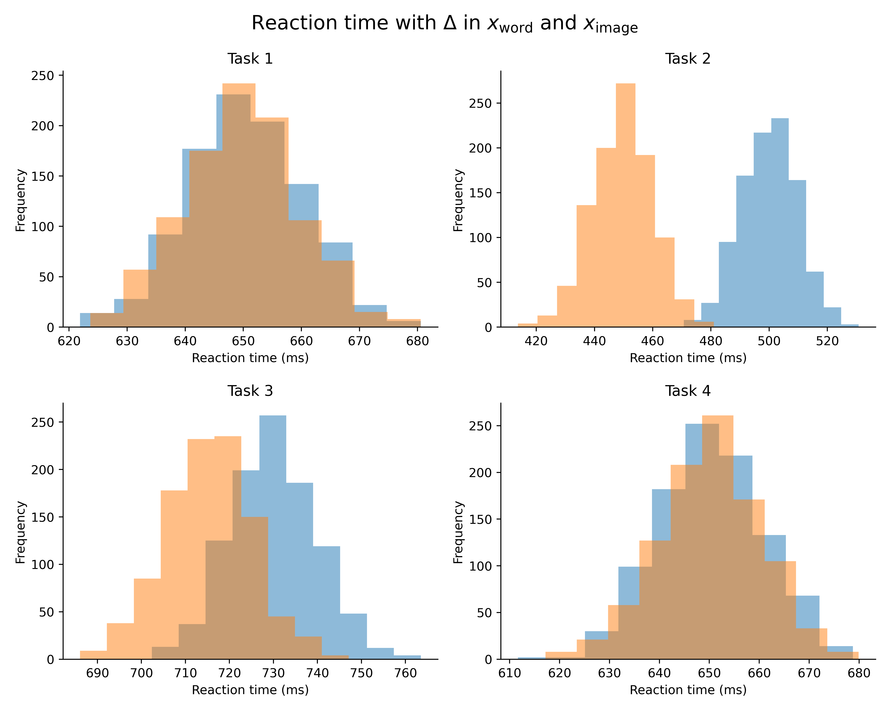

# wiscs-simulation
> **W**ords and **i**mages in **s**hared **c**onceptual **s**pace

We hypothesize that knowledge of words and images exists in a shared conceptual space, $C$ (see [main.png](figs/main.png)). Interacting with words and images probes that space ($\mathbf{t_n}$). This process is denoted as $S$ with an expected value $E(S) \approx \mathbf{p} + \mathbf{x} + \mathbf{t_n}$[1](#1) under the alternative hypothesis (proposed below). $S$ is the reaction time from the onset of a stimulus (word or picture) to the execution of a semantic task. It is an _observed_ value. We can estimate $\mathbf{x}$ or $\mathbf{p}$ by subtracting from $S$. Take the following example.

$$
S = 500\text{ms} \\
\mathbf{p} = 100\text{ms} \\
\mathbf{t_n} = 150\text{ms} \\
\mathbf{x} = S - (\mathbf{p} + \mathbf{t_n}) := 500 - (100 + 150) = 250\text{ms}
$$

<!-- 

  

 -->

# How does $\Delta (\mathbf{x_{word}}, \mathbf{x_{image}})$ affect task processing?
We hypothesize that _**there will be no difference in task processing across modalities**_ ($\mathbf{t_n}$). 

However, differences in $\mathbf{x_{word}}$ and $\mathbf{x_{image}}$ may inadvertantly affect the time it takes to pull from the shared conceptual space. 

Below, we model a difference in $\mathbf{x_{word}}$ and $\mathbf{x_{image}}$ based on [Bezsudnova et al., 2024](https://direct.mit.edu/jocn/article/36/8/1760/121050/Spatiotemporal-Properties-of-Common-Semantic). The time it takes to activate the conceptual representation corresponding to a given image (~150ms) is markdely faster than that of a word (~230ms).

These distributions are starkly different. Compare this to our hypothesis, that there is **no** difference in task processing across modality. 

# How can we account for this?

Test multiple tasks! :white_check_mark: 

Perhaps a given task forces top-down pressures to increase the processing needed to go from perceptual input to conceptual space. Testing a variety of tasks can determine if and how $\mathbf{x_{word}}$ and $\mathbf{x_{image}}$ affect semantic processing.

# 

# Notes
[1] $\mathbf{p, x}$ and $\mathbf{t_n}$ are scalars. $\mathbf{p}$ is also a constant. 