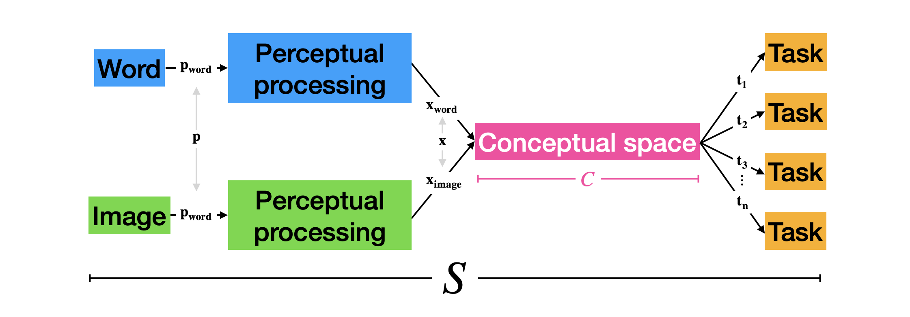
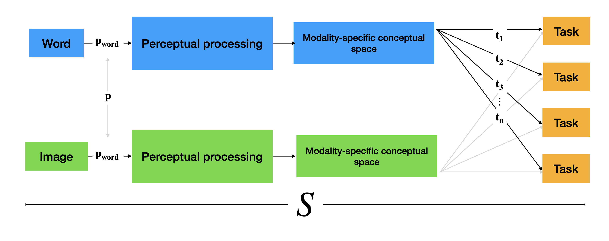
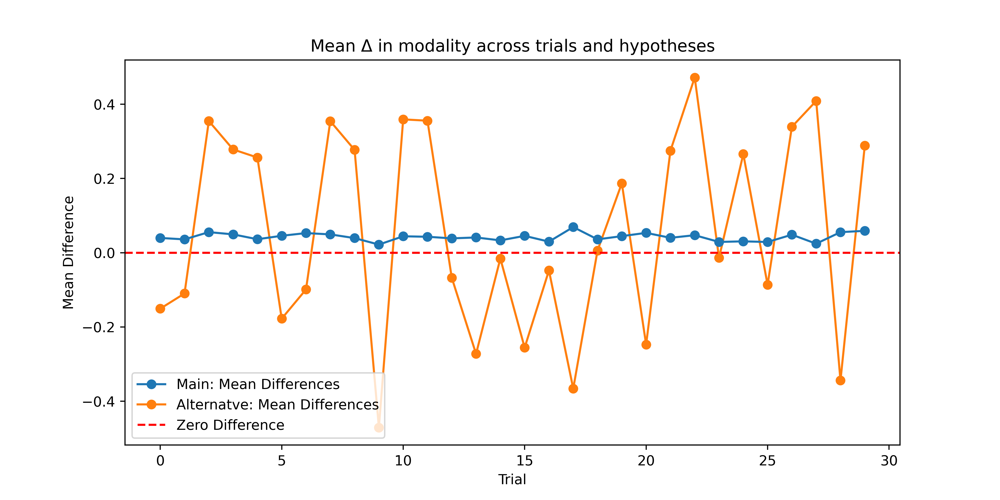

# WISCS - simulations
> **W**ords and **i**mages in **s**hared **c**onceptual **space** - simulations

## What are we hypothesizing?

We hypothesize that the meanings of words and images exist in a shared conceptual space.

Here, we model $S$, the corresponding reaction time associated with semantic processing, as the sum of perceptual, conceptual, and task-specific processes (and some error). 

$$

S = \mathbf{p} + \mathbf{x} + \mathbf{t} + \epsilon

$$

## What data do we expect?

Because of this, we expect that, across trial-blocks, differences in reaction times across words and images will be the same.

### An alternative hypothesis

We contrast these data with an alternative hypothesis, that conceptual processing is modality specific. 

If this is the case, differences in reaction times acorss words and images over trials will not be consistent. 

The variability across trials is clear.

## A comparative look
Let's see how this looks through a different angle.

The y-axis is trials and the x-axis is the differene in RT between word and image items. Our main hypothesis suggests that there will be little differences, as seen by the blue line. The alternative shows high variability across trials. 