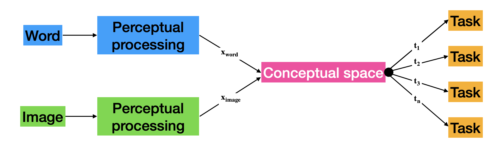
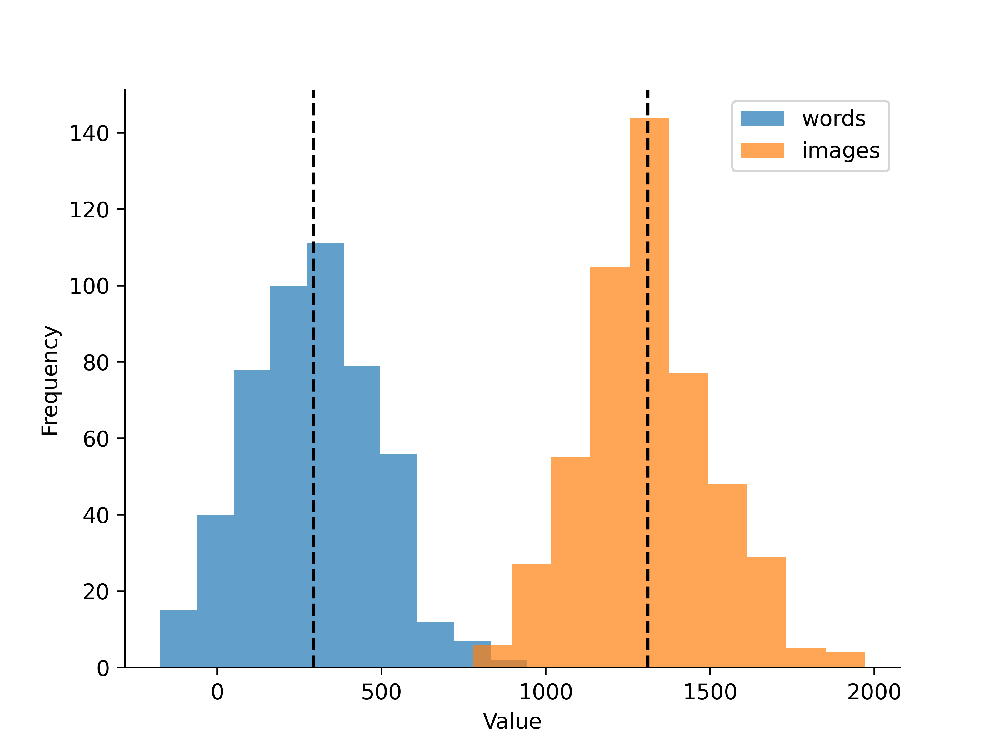

# wiscs-simulation
> **W**ords and **i**mages in **s**hared **c**onceptual **s**pace

We hypothesize that knowledge of the words and images exists in a shared conceptual space. Interacting with words and images probes that space ($\mathbf{t_n}$). Previous work presupposes that $\mathbf{x_{word}}$ and $\mathbf{x_{image}}$ are equal.[^1]

# How does $\Delta (\mathbf{x_{word}}, \mathbf{x_{image}})$ affect task processing?
We hypothesize that _**there will be no difference in task processing across modalities**_ ($\mathbf{t_n}$). 

However, differences in $\mathbf{x_{word}}$ and $\mathbf{x_{image}}$ may inadvertantly affect the time it takes to pull from the shared conceptual space. 

Below, we model a difference in $\mathbf{x_{word}}$ and $\mathbf{x_{image}}$ based on [Bezsudnova et al., 2024](https://direct.mit.edu/jocn/article/36/8/1760/121050/Spatiotemporal-Properties-of-Common-Semantic). The time it takes to activate the conceptual representation corresponding to a given image (~150ms) is markdely faster than that of a word (~230ms).

These distributions are starkly different. Compare this to our hypothesis, that there is **no** difference in task processing across modality. 

# How can we account for this?

Test multiple tasks! :white_check_mark: 

Perhaps a given task forces top-down pressures to increase the processing needed to go from perceptual input to conceptual space. Testing a variety of tasks can determine if and how $\mathbf{x_{word}}$ and $\mathbf{x_{image}}$ affect semantic processing.

# Notes
[^1]:
$\mathbf{x_{word}}$, $\mathbf{x_{image}}$ and $\mathbf{t_n}$ are scalars.
